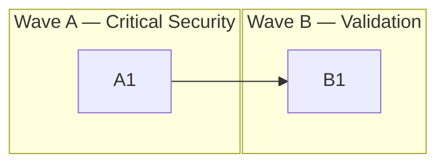

# Project Tasks

> TaskFlow API — A REST API for task management built with Express, TypeScript, and Prisma.
> Each task = 1 PR with clear acceptance criteria.

---

## Task Status Legend

| Status | Meaning                    |
| ------ | -------------------------- |
| `[ ]`  | not-started                |
| `[~]`  | in-progress                |
| `[x]`  | completed                  |
| `[!]`  | blocked (needs discussion) |

---

## Quality Baseline

| Metric              | Current   | Target       |
| ------------------- | --------- | ------------ |
| Test coverage       | 62%       | No decrease  |
| Linter errors       | 0         | 0            |
| Linter warnings     | 14        | 0            |
| Type errors         | 0         | 0            |
| Longest function    | 142 lines | ≤ 50         |
| Largest file        | 487 lines | ≤ 300        |
| Dependency vulns    | 3         | 0            |

---

## Current Tasks

### Wave A — Critical Security Fixes

_Fix authentication bypass and data exposure vulnerabilities._

| Status | ID   | Task                                                    | Priority | Size | Dependencies |
| ------ | ---- | ------------------------------------------------------- | -------- | ---- | ------------ |
| `[ ]`  | `A1` | [Fix JWT Auth Bypass](tasks/A1-fix-auth-bypass.md)      | Critical | S    | None         |

### Wave B — Input Validation & Reliability

_Add missing input validation and error handling across API endpoints._

| Status | ID   | Task                                                              | Priority | Size | Dependencies |
| ------ | ---- | ----------------------------------------------------------------- | -------- | ---- | ------------ |
| `[ ]`  | `B1` | [Add Request Validation](tasks/B1-add-input-validation.md)        | High     | M    | A1           |

---

## Dependency Graph



---

## Verification Commands Reference

```bash
npx eslint src/                    # Lint
npx prettier --check src/          # Format check
npx tsc --noEmit                   # Type check
npm run build                      # Build
npm test                           # Test
npm run test:coverage              # Coverage
```

---

## Guardrails

### PR Size Limits

| Rule                           | Limit     | Action                           |
| ------------------------------ | --------- | -------------------------------- |
| Max files changed per PR       | 8         | Split into subtasks              |
| Max diff lines (added+removed) | 500       | Split into subtasks              |
| XL task detected               | > 8 files | **STOP and split before coding** |

### Quality Gates (must pass before PR)

| Check        | Command                     | Enforcement        |
| ------------ | --------------------------- | ------------------ |
| Linter       | `npx eslint src/`           | Zero new warnings  |
| Formatter    | `npx prettier --check src/` | No unformatted files |
| Type checker | `npx tsc --noEmit`          | Zero new errors    |
| Build        | `npm run build`             | Must pass          |
| Tests        | `npm test`                  | Must pass          |
| Coverage     | `npm run test:coverage`     | No decrease        |

### Code Complexity Limits

| Metric                 | Limit     | Action                           |
| ---------------------- | --------- | -------------------------------- |
| Function/method length | 50 lines  | Extract helper functions         |
| File length            | 300 lines | Split into modules               |
| Nesting depth          | 4 levels  | Use early returns, extract methods |
| Function parameters    | 4 params  | Use options/config object        |
| Cyclomatic complexity  | 10 per fn | Simplify branching logic         |

### Process

| Rule                 | Value        | Action                |
| -------------------- | ------------ | --------------------- |
| Code review required | All PRs      | Required before merge |
| Ambiguity detected   | Missing info | **STOP and ask user** |
