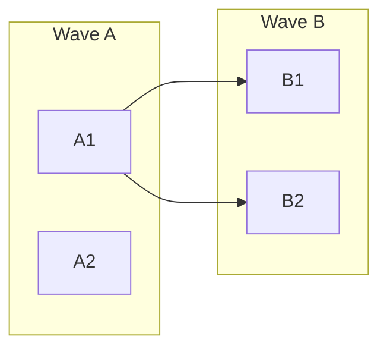

# Prioritize and Group

## Step 1 — Assign Priority

| Priority | Criteria                                                                                   | Action                  |
| -------- | ------------------------------------------------------------------------------------------ | ----------------------- |
| Critical | Security vulnerabilities, data loss, broken core features, API contract breaks             | Fix immediately         |
| High     | Missing validation, missing error handling, type errors, config failures, migration safety | Fix in current cycle    |
| Medium   | Missing features, performance issues, poor coverage, missing tooling, observability gaps   | Schedule for next cycle |
| Low      | Dead code, formatting, stale comments, doc gaps, dependency updates                        | Opportunistic cleanup   |

## Step 2 — Estimate Size

| Size | Lines Changed | Files Touched | Typical Duration | Example                              |
| ---- | ------------- | ------------- | ---------------- | ------------------------------------ |
| S    | < 50          | 1-2           | < 1 hour         | Fix a single validation bug          |
| M    | 50-200        | 3-5           | 1-4 hours        | Add input validation to a module     |
| L    | 200-500       | 5-8           | 4-8 hours        | Refactor a service layer             |
| XL   | > 500         | > 8           | > 8 hours        | **Must be split before work begins** |

### Splitting XL Tasks

If a task exceeds 8 files or 500 lines, split it during planning:

1. Find natural seams (by module, by endpoint, by layer)
2. Each sub-task must independently pass build and tests
3. Assign sub-tasks sequential IDs within the same wave (e.g., B1, B2, B3)
4. Add dependency edges between sub-tasks if order matters

## Step 3 — Organize into Waves

Waves are lettered A through F. Each wave is a batch of tasks that can be worked in parallel.

| Wave | Contains                                      | Rule                      |
| ---- | --------------------------------------------- | ------------------------- |
| A    | Critical fixes with no dependencies           | All can start immediately |
| B    | High-priority, depends only on A (or nothing) | Start after A completes   |
| C    | Medium-priority foundation work               | Start after B             |
| D-F  | Remaining work in dependency order            | Start after prior wave    |

### Wave Rules

- Tasks in the same wave **must not** modify the same files (prevents merge conflicts)
- If two tasks touch the same file, they must be in different waves with a dependency edge
- Each wave should be completable in a reasonable sprint (not 50 tasks)
- Prefer fewer, larger waves over many tiny waves

## Step 4 — Map Dependencies

For each task, record what it depends on:

- **Explicit dependency:** Task B1 modifies code that Task A1 creates
- **File conflict:** Task B2 and B3 both touch `auth.ts` → put one in Wave C
- **Logical dependency:** "Add validation" depends on "Set up Zod" even if different files

Generate a Mermaid dependency graph:



## Step 5 — Assign IDs

Format: `{WaveLetter}{SequenceNumber}` — e.g., `A1`, `A2`, `B1`, `C1`

- IDs are permanent — never reuse a retired ID
- Sequence within a wave is arbitrary (not priority order)
- Reference IDs in dependency fields, commit messages, branch names

## Scope Management

If the analysis produces more than ~25 tasks:

- Focus the detailed backlog on Waves A-C (Critical, High, and foundation Medium)
- Group remaining findings into a "Future Work" section in BACKLOG.md with brief descriptions but no full task files
- Ask the user if they want the full backlog expanded

If the project is a monorepo, generate one BACKLOG.md per package/app unless the user requests a unified backlog.

### Monorepo Output Structure

When generating per-package backlogs:

```
packages/
  api/
    tasks/
      BACKLOG.md              # Package-specific backlog
      README.md               # Package-specific workflow
      A1-fix-auth.md
  web/
    tasks/
      BACKLOG.md
      README.md
      A1-fix-routing.md
.ai/rules/
  project.md                  # Shared conventions (common patterns)
  code-style.md               # Shared code style
  testing.md                  # Shared testing conventions
  security.md                 # Shared security conventions
  quality.md                  # Shared quality conventions
  packages/
    api.md                    # Package-specific overrides for api
    web.md                    # Package-specific overrides for web
AGENTS.md                     # Root entry point referencing all packages
tasks/
  BACKLOG.md                  # Cross-package tasks only (shared library changes, etc.)
```

- Shared rules go in `.ai/rules/` at the root. Package-specific overrides go in `.ai/rules/packages/{name}.md`.
- Each package's `BACKLOG.md` links to both shared and package-specific rules.
- Cross-package tasks (e.g., shared library changes affecting multiple packages) go in the root-level `tasks/` directory with dependencies on the packages they affect.
- Agent pointer files are generated once at the root level, not per-package.

## Documentation-First Wave Structure

For new projects built from docs, waves follow a natural build order:

| Wave | Contains                        | Examples                                                                             |
| ---- | ------------------------------- | ------------------------------------------------------------------------------------ |
| A    | Project scaffolding and tooling | Init project, configure linter/formatter/TypeScript, set up test runner, CI pipeline |
| B    | Core infrastructure             | Database setup, auth system, API framework, error handling, logging                  |
| C    | Core features (MVP)             | Primary endpoints/pages from the feature doc, data models, business logic            |
| D    | Secondary features              | Additional endpoints, integrations, admin features                                   |
| E-F  | Polish and optimization         | Monitoring, performance tuning, documentation, edge cases                            |

Within each wave, the same rules apply: no file conflicts, explicit dependencies, each task independently builds and tests.
