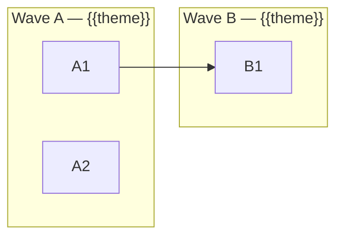

# Backlog Format

Generate `tasks/BACKLOG.md` using this template.

## Template

````markdown
# Project Tasks

> {{project name}} — {{one-line description}}.
> Each task = 1 PR with clear acceptance criteria.

---

## Task Status Legend

| Status | Meaning |
|--------|---------|
| `[ ]` | not-started |
| `[~]` | in-progress |
| `[x]` | completed |
| `[!]` | blocked (needs discussion) |

---

## Quality Baseline

| Metric | Current | Target |
|--------|---------|--------|
| Test coverage | {{X%}} | No decrease |
| Linter errors | {{N}} | 0 |
| Linter warnings | {{N}} | {{target}} |
| Type errors | {{N or N/A}} | 0 |
| Longest function | {{N lines}} | ≤ {{limit}} |
| Largest file | {{N lines}} | ≤ {{limit}} |
| Dependency vulns | {{N or N/A}} | 0 |
| Bundle size | {{N or N/A}} | {{target}} |


---

## Current Tasks

### Wave A — {{Wave Theme}}

_{{One-line description of wave focus}}_

| Status | ID | Task | Priority | Size | Dependencies |
|--------|----|------|----------|------|-------------|
| `[ ]` | `A1` | [Task Title](A1-slug.md) | Critical | S | None |

### Wave B — {{Wave Theme}}

_{{One-line description}}_

| Status | ID | Task | Priority | Size | Dependencies |
|--------|----|------|----------|------|-------------|
| `[ ]` | `B1` | [Task Title](B1-slug.md) | High | M | A1 |

{{...repeat for each wave...}}

---

## Dependency Graph



---

## Verification Commands Reference

```bash
{{lint command}}
{{format check command}}
{{type check command}}
{{build command}}
{{test command}}
{{coverage command}}
```

---

## Guardrails

### PR Size Limits

| Rule | Limit | Action |
|------|-------|--------|
| Max files changed per PR | 8 | Split into subtasks |
| Max diff lines (added+removed) | 500 | Split into subtasks |
| XL task detected | > 8 files | **STOP and split before coding** |

### Quality Gates (must pass before PR)

| Check | Command | Enforcement |
|-------|---------|-------------|
| Linter | `{{command}}` | Zero new warnings |
| Formatter | `{{command}}` | No unformatted files |
| Type checker | `{{command}}` | Zero new errors |
| Build | `{{command}}` | Must pass |
| Tests | `{{command}}` | Must pass |
| Coverage | `{{command}}` | No decrease |

### Code Complexity Limits

| Metric | Limit | Action |
|--------|-------|--------|
| Function/method length | {{N}} lines | Extract helper functions |
| File length | {{N}} lines | Split into modules |
| Nesting depth | {{N}} levels | Use early returns, extract methods |
| Function parameters | {{N}} params | Use options/config object |
| Cyclomatic complexity | {{N}} per fn | Simplify branching logic |

### Process

| Rule | Value | Action |
|------|-------|--------|
| Code review required | All PRs | Required before merge |
| Ambiguity detected | Missing info | **STOP and ask user** |
````

## Calibrating Limits

Use the project's existing patterns to set limits:

- **Function length:** Find the 90th percentile of current functions. If most are under 40 lines, set limit to 50.
- **File length:** Find the 90th percentile. If most files are under 250 lines, set limit to 300.
- **Nesting depth:** 4 levels is a good default for most languages.
- **Parameters:** 4 is a good default. Languages with builder patterns may allow more.
- **Cyclomatic complexity:** 10 is a widely-accepted default.

If existing code far exceeds these limits, note the hotspots in quality.md and set aspirational targets.
