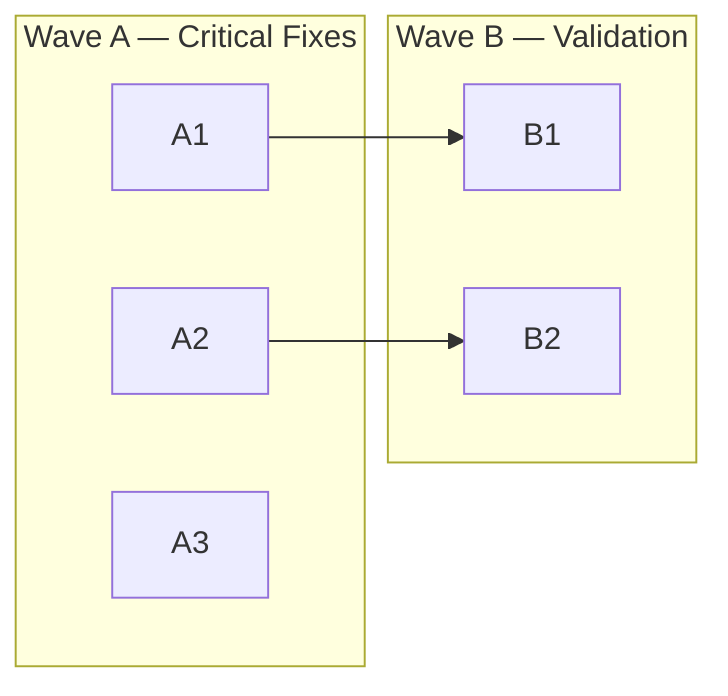

# Project Analysis Instructions

> Reusable instructions for an AI agent to analyze any project and generate a structured task backlog.
> Copy this file into a project's `.agent/` folder, then instruct the agent to follow it.

---

## Overview

This document instructs you to:

1. **Analyze** the project — read every source file, configuration, test, and documentation
2. **Identify** bugs, security issues, missing features, dead code, and improvements
3. **Extract** project conventions — code style, testing patterns, security practices, architecture decisions
4. **Generate** a structured `.agent/` folder with a task index, per-task detail files, and a workflow guide
5. **Generate** a `.claude/` folder with project instructions and convention rules

**Output structure:**

```
.agent/
├── ANALYZE.md                      # This file (instructions — keep for future re-analysis)
├── TASKS.md                        # Task index with priority-ordered waves
├── README.md                       # Agent workflow guide
└── tasks/
    ├── A1-short-slug.md            # Individual task files
    ├── A2-short-slug.md
    ├── B1-short-slug.md
    └── ...

.ai/
└── rules/                          # Canonical rules (shared across all AI tools)
    ├── project.md                  # Project structure and architecture guidelines
    ├── code-style.md               # Code style and formatting conventions
    ├── testing.md                  # Testing conventions and requirements
    ├── security.md                 # Security requirements and practices
    └── quality.md                  # Code quality thresholds and complexity limits

AGENTS.md                           # Universal agent entry point (root of project)

.claude/
└── CLAUDE.md                       # Claude-specific pointer to .ai/rules/

.github/
├── copilot-instructions.md         # Copilot pointer to .ai/rules/
└── instructions/                   # Path-specific Copilot instructions (optional)
    └── *.instructions.md

.junie/
└── guidelines.md                   # Junie pointer to .ai/rules/

.vscode/
└── settings.json                   # Editor settings + Copilot instruction references
```

> **Multi-agent architecture:** Rules live in `.ai/rules/` as a single source of truth. Each AI tool gets a thin pointer file. See [MULTI-AGENT-SETUP.md](../docs/MULTI-AGENT-SETUP.md) for details.

---

## When to Run This Analysis

### Initial Analysis

Run the full analysis (all phases) when first setting up the `.agent/` folder for a project.

### Re-Analysis Triggers

Re-run the analysis (or specific phases) when:

- **Major refactors** — architecture, directory structure, or core module changes
- **Wave completion** — after completing an entire wave, re-assess remaining tasks for accuracy
- **New team member onboarding** — verify that conventions and task descriptions are still current
- **Dependency overhaul** — upgrading frameworks, switching libraries, or adding major integrations
- **Stale backlog** — if more than 30% of tasks feel outdated or irrelevant, re-analyze
- **Post-incident** — after a security incident or production outage, re-run Phase 1.4 (findings)

When re-analyzing, preserve completed task history (mark old tasks `[x]` rather than deleting them) and use new IDs for newly discovered tasks.

---

## Phase 1: Deep Analysis

Read and understand the entire project before generating any output.

### 1.1 — Read Everything

- [ ] All source files (every directory, every file)
- [ ] Configuration files (build configs, linters, formatters, CI/CD)
- [ ] Package/dependency manifests
- [ ] Existing documentation (README, docs/, wikis, comments)
- [ ] Existing TODO/FIXME/HACK comments in source code
- [ ] Test files and test configuration
- [ ] Environment and deployment configuration
- [ ] Data files, schemas, migrations
- [ ] Linter and formatter configuration (ESLint, Prettier, Pylint, Rubocop, etc.)
- [ ] Pre-commit hooks and CI pipeline definitions
- [ ] Code coverage configuration and reports (if any)
- [ ] Type checker configuration (tsconfig, mypy.ini, etc.)

### 1.2 — Map the Architecture

Document your understanding of:

- **Project purpose** — What does this project do?
- **Entry points** — Where does execution start?
- **Core components** — What are the main modules/classes/services?
- **Data flow** — How does data move through the system?
- **External dependencies** — What libraries/services does it rely on?
- **Build and run process** — How is the project built, tested, and run?
- **Test infrastructure** — What testing exists and what's the coverage?
- **Quality tooling** — What linters, formatters, type checkers, and static analysis tools are configured?

### 1.3 — Extract Conventions

While reading the codebase, extract the following conventions and patterns. These will be used to generate the `.claude/` rules files.

#### Code Style

- Naming patterns (files, classes, functions, variables, constants)
- Formatting style (indentation, line length, bracket placement)
- Import organization (ordering, grouping, path aliases)
- Comment style and documentation patterns
- Error handling patterns (how errors are thrown, caught, propagated)
- Logging patterns (what logger is used, log levels, message format)

#### Code Quality & Complexity

- Automated formatter (Prettier, Black, gofmt, etc.) — tool and config
- Linter(s) in use (ESLint, Pylint, Clippy, etc.) — tool, config, and custom rules
- Type checker (TypeScript, mypy, Flow, etc.) — strictness level
- Static analysis tools (SonarQube, CodeClimate, etc.)
- Pre-commit hooks — what checks run automatically
- Observed function length patterns (typical and maximum)
- Observed file length patterns (typical and maximum)
- Nesting depth patterns (how deep do conditionals/loops go)
- Documentation patterns (which functions/classes have docstrings, which don't)

#### Architecture

- Directory structure and module organization
- Design patterns in use (MVC, service layer, repository, etc.)
- State management approach
- Configuration management (env vars, config files, constants)
- Dependency injection or initialization patterns
- Error handling strategy (error types, propagation, recovery patterns)
- Observability approach (structured logging, metrics, tracing, health checks)
- API design patterns (REST conventions, versioning, schema validation)
- Backward compatibility strategy (deprecation process, versioning policy)

#### Testing

- Test framework and runner
- Test file location and naming convention
- Test structure (describe/it, arrange-act-assert, given-when-then)
- Mocking and fixture patterns
- What is tested vs. what is not
- Coverage requirements (if any)
- Coverage tool and configuration
- Current coverage percentage (if measurable)
- Test categorization (unit, integration, e2e — and how they're separated)

#### Security

- Authentication and authorization patterns
- Input validation approach
- Secret management (how keys, tokens, credentials are handled)
- Data sanitization patterns
- Encryption usage

#### Dependencies

- Package manager and lockfile
- Version pinning strategy (exact, caret, tilde)
- Internal vs. external dependency boundaries
- Dependency approval process (if any)
- Known vulnerability scanning (Dependabot, Snyk, npm audit, etc.)

#### Convention Gaps

While extracting conventions, note areas where the project has **no clear convention** but should. These will be flagged in the rules files as "No established convention — recommended:" with a suggestion, clearly separated from observed patterns. Do not invent conventions and present them as existing practice.

### 1.4 — Identify Findings

Systematically look for issues in these categories:

#### Critical — Security & Correctness

- Security vulnerabilities (injection, auth bypass, data exposure, crypto misuse)
- Data corruption or loss scenarios
- Race conditions or concurrency bugs on shared mutable state
- Broken core functionality (features that don't work as intended)
- Consensus or consistency violations (for distributed systems)
- Breaking changes to public APIs or contracts without versioning

#### High — Validation & Reliability

- Missing input validation
- Missing error handling (empty catch blocks, unhandled promises/exceptions)
- Unstructured or inconsistent error types (no standard error hierarchy)
- Missing retry logic or graceful degradation for external service calls
- Incorrect or incomplete business logic
- Missing boundary checks
- Inconsistent state management
- Functions with excessive complexity (deeply nested, too many branches, too long)
- Missing type safety or type errors (for typed languages)
- Missing configuration validation at startup (silent fallback to bad defaults)
- Database migrations without rollback path

#### Medium — Features & Improvements

- Missing features that are expected or documented but not implemented
- Hardcoded values that should be configurable
- Performance bottlenecks (no baselines or benchmarks to detect regressions)
- Poor test coverage (files or modules with no tests)
- Tight coupling between components
- Test bypasses or environment-specific hacks in production code
- Missing or disabled linter rules that should be active
- Functions or files that are excessively long but not breaking
- Missing documentation on public APIs or complex logic
- Missing formatter, linter, or type checker setup (if project has none)
- Missing structured logging or observability (no tracing, no health checks)
- API endpoints without schema validation or contract tests
- Missing backward compatibility strategy for public interfaces
- Non-idempotent operations that should be idempotent (APIs, message handlers, migrations)
- Dev/staging/production environment inconsistencies

#### Low — Cleanup & Polish

- Dead code (unused functions, variables, imports, config values)
- Inconsistent naming or formatting
- Missing or scattered logging
- Documentation gaps
- Dependency updates
- Dependencies with incompatible or unknown licenses
- Linter warnings that are suppressed but shouldn't be
- Inconsistent formatting that a formatter would fix
- Stale or redundant comments
- Missing deprecation notices on superseded interfaces

### 1.5 — Triage Existing TODOs

For every `TODO`, `FIXME`, `HACK`, `XXX`, and `WORKAROUND` comment found in the source:

1. **Evaluate relevance** — Is the issue still present, or has it been resolved without removing the comment?
2. **Assess severity** — Does this warrant a task, or is it trivial enough to fold into an adjacent task?
3. **Create or absorb** — Either create a dedicated task or note it under a related task's implementation steps
4. **Flag stale comments** — If the TODO references resolved issues, create a Low-priority cleanup task to remove them

### 1.6 — Measure Code Quality Baseline

Before generating tasks, measure the current state of quality so tasks can target specific improvements:

1. **Run the linter** (if configured) — count total warnings and errors by category
2. **Run the formatter** (if configured) — check if code is already formatted (or how many files would change)
3. **Run the type checker** (if configured) — count type errors
4. **Measure test coverage** (if tooling exists) — record overall percentage and per-module breakdown
5. **Identify complexity hotspots** — find the longest functions, deepest nesting, and largest files
6. **Record performance baselines** (if benchmarks exist) — run existing benchmarks and record results (response times, memory usage, bundle size). If no benchmarks exist but performance matters, note this as a finding
7. **Check dependency health** — run vulnerability scanner (npm audit, Dependabot, Snyk), note outdated dependencies and license concerns

Record these baselines in the task files so that improvements are measurable. If no tooling is configured, note this as a finding (and generate a task to set it up if appropriate).

---

## Phase 2: Prioritize and Group

### 2.1 — Assign Priority

Every finding gets a priority:

| Priority     | Criteria                                                              |
| ------------ | --------------------------------------------------------------------- |
| **Critical** | System is broken, insecure, or produces incorrect results without fix |
| **High**     | Significant gap in validation, reliability, or core feature           |
| **Medium**   | Missing feature, improvement, or moderate risk                        |
| **Low**      | Cleanup, polish, nice-to-have                                         |

### 2.2 — Estimate Size

Every task gets a t-shirt size estimate:

| Size    | Meaning                                          | Guideline                      |
| ------- | ------------------------------------------------ | ------------------------------ |
| **S**   | Small, focused change                            | 1-2 files, < 100 lines        |
| **M**   | Moderate change across a few files               | 3-5 files, 100-300 lines      |
| **L**   | Large change spanning multiple modules           | 6-8 files, 300-500 lines      |
| **XL**  | Too large for a single PR — **must be split**    | > 8 files or > 500 lines      |

**Splitting XL tasks:** If a task estimates as XL, break it into subtasks during Phase 2. Use separate sequential IDs (e.g., `B3`, `B4`, `B5` for what was originally one finding), and add dependency links between the sub-parts. Each sub-task must independently pass build and tests.

### 2.3 — Group into Waves

Organize findings into **priority-ordered waves** labeled A through F (or beyond if needed):

| Wave | Purpose                         | Start Condition                 |
| ---- | ------------------------------- | ------------------------------- |
| A    | Critical fixes                  | Immediately, all independent    |
| B    | Core validation and reliability | After relevant A tasks complete |
| C    | Hardening and robustness        | After relevant B tasks complete |
| D    | Infrastructure and integration  | After core is solid             |
| E    | Features and improvements       | After infrastructure is ready   |
| F    | Cleanup and nice-to-have        | Anytime, lowest priority        |

**Rules:**

- **Wave A is reserved for Critical priority items.** Tasks must be both Critical priority AND have no dependencies to be placed in Wave A.
- Each subsequent wave unlocks after its dependencies in previous waves are met.
- Tasks within a wave may depend on each other — that's fine.
- Lower-priority tasks with no dependencies may be placed in earlier waves **only if** they are prerequisites for higher-priority work. Otherwise, they belong in the wave matching their priority tier.
- A task's wave is determined by the **combination** of its priority tier and its earliest possible start (dependency freedom).
- Independent Low-priority tasks go in Wave F regardless of having no dependencies — they don't belong in Wave A just because they're independent.

### 2.4 — Map Dependencies

For each task, identify:

- Which other tasks must complete first (prerequisites)
- Which tasks this enables (dependents)

Dependencies should reference task IDs (e.g., `A1`, `B3`), not wave labels.

**Resolving file conflicts:** If two tasks modify the same file in overlapping ways:

1. **Preferred:** Add a dependency between them (later task depends on earlier one)
2. **Alternative:** If both are independent, define non-overlapping regions of the file each task owns
3. **Last resort:** Merge the tasks into one if they can't be cleanly separated

### 2.5 — Assign IDs

Within each wave, number tasks sequentially:

- Wave A: `A1`, `A2`, `A3`, `A4`
- Wave B: `B1`, `B2`, `B3`, `B4`
- etc.

Order within a wave: higher priority and fewer dependencies first.

---

## Phase 3: Generate Output

### 3.1 — Generate Per-Task Files

Create one file per task in `.agent/tasks/`.

**File naming:** `<ID>-<short-slug>.md` (e.g., `A1-fix-auth-bypass.md`, `B3-add-input-validation.md`)

**Slug rules:**

- Lowercase, hyphen-separated
- 2-4 words describing the task
- No language or framework names in the slug

**Template:**

````markdown
# Task {{ID}}: {{Title}}

| Field            | Value                              |
| ---------------- | ---------------------------------- |
| **ID**           | `{{ID}}`                           |
| **Status**       | `[ ]`                              |
| **Priority**     | {{Critical / High / Medium / Low}} |
| **Size**         | {{S / M / L}}                      |
| **Dependencies** | {{Comma-separated IDs, or "None"}} |
| **Branch**       | `{{prefix}}/{{id-slug}}`           |

**Goal:**
{{1-3 sentences explaining what this task achieves and why it matters.}}

**Current State:**

{{Include for bug fixes, security issues, performance bottlenecks, and validation gaps. Show the problematic code, describe the incorrect behavior, or explain the current risk. Use a fenced code block if showing code. Include measured baselines where available (e.g., "Current coverage: 42%", "Function X is 180 lines with 12 branches", "Linter reports 23 warnings in this module").}}

**Scope:**

```
{{project-relative path}}/
├── file-to-create                  # CREATE — brief description
├── file-to-modify                  # MODIFY — what changes
├── file-to-delete                  # DELETE — why removing
└── file-to-verify                  # VERIFY — check consistency
```

**Implementation:**

1. {{Specific, actionable step}}
2. {{Specific, actionable step}}
3. {{Specific, actionable step}}

**Testing Requirements:**

- [ ] {{New test or updated test that verifies the fix/feature}}
- [ ] {{Regression test that would have caught the original issue, if applicable}}
- [ ] {{Edge case tests for boundary conditions}}
- [ ] {{Coverage target: e.g., "New code must have ≥ 80% line coverage" or "No decrease in overall coverage"}}

**Acceptance Criteria:**

- [ ] {{Observable, testable criterion}}
- [ ] {{Observable, testable criterion}}
- [ ] {{Observable, testable criterion}}
- [ ] New/updated tests cover the change
- [ ] No function exceeds {{N}} lines
- [ ] No new linter warnings: `{{lint command}}`
- [ ] Code is formatted: `{{format check command}}`
- [ ] Build passes: `{{project build command}}`
- [ ] Tests pass: `{{project test command}}`
- [ ] Coverage has not decreased: `{{coverage command}}`

**Risk & Rollback:**

{{For Critical and High priority tasks. Describe what could go wrong and how to recover.}}

- **Risk:** {{What might break or regress}}
- **Rollback:** {{How to revert if the change causes issues — e.g., "Revert the PR; no data migration involved" or "Requires re-running migration X"}}
- **Side effects:** {{Other components or systems that might be affected}}

**Verification Commands:**

```bash
{{project lint command}}
{{project format check command}}
{{project type check command (if applicable)}}
{{project build command}}
{{project test command}}
{{project coverage command}}
{{any additional verification steps}}
```
````

**Branch prefix conventions:**

| Task Type       | Prefix      | Example                       |
| --------------- | ----------- | ----------------------------- |
| Bug fix         | `fix/`      | `fix/a1-auth-bypass`          |
| New feature     | `feature/`  | `feature/d1-rest-api`         |
| Refactor        | `refactor/` | `refactor/c3-extract-service` |
| Test            | `test/`     | `test/e6-coverage`            |
| Chore / cleanup | `chore/`    | `chore/f2-logging`            |

**Branch naming rules:**

- Always lowercase
- Format: `{{prefix}}/{{task-id-lowercase}}-{{slug}}` (e.g., `fix/a1-auth-bypass`)
- Task ID in the branch must be lowercase to match the slug portion (e.g., `a1` not `A1`)
- The slug in the branch should match the file slug exactly

**Writing guidelines:**

- **Goal** — Focus on the "why" and the outcome, not implementation details
- **Current State** — Include for fixes, security issues, performance problems, and validation gaps. Show the actual broken code or behavior. Include measured baselines (coverage %, complexity scores, linter warning counts). Omit only for pure feature additions or cleanup tasks with no "before" state to show
- **Scope** — List every file that will be touched. Use a tree structure with action annotations
- **Implementation** — Numbered steps an agent can follow without interpretation. Be specific about what to do in each file
- **Testing Requirements** — Explicitly state what new or updated tests are needed. For bug fixes, always require a regression test that would have caught the original issue. Include a coverage expectation
- **Acceptance Criteria** — Must be verifiable without subjective judgment. Always include complexity limit, linter, formatter, build, test, and coverage as final criteria
- **Risk & Rollback** — Required for Critical and High priority tasks. Optional but encouraged for Medium. Omit for Low-priority cleanup tasks
- **Verification Commands** — Copy-pasteable commands. Include lint, format, type check, build, test, and coverage commands. Include comments for manual verification steps

**Section inclusion rules:**

| Section                  | Required For                    | Omit For                          |
| ------------------------ | ------------------------------- | --------------------------------- |
| Goal                     | All tasks                       | Never omit                        |
| Current State            | Fixes, security, perf, validation | Pure features, cleanup           |
| Scope                    | All tasks                       | Never omit                        |
| Implementation           | All tasks                       | Never omit                        |
| Testing Requirements     | All tasks                       | Never omit                        |
| Acceptance Criteria      | All tasks                       | Never omit                        |
| Risk & Rollback          | Critical, High                  | Low (optional for Medium)         |
| Verification Commands    | All tasks                       | Never omit                        |

### 3.2 — Generate TASKS.md

Create `.agent/TASKS.md` as the central task index.

**Template:**

````markdown
# Project Tasks

> {{One-line project description}}.
> Each task = 1 PR with clear acceptance criteria.

---

## Task Status Legend

| Status | Meaning                    |
| ------ | -------------------------- |
| `[ ]`  | not-started                |
| `[~]`  | in-progress                |
| `[x]`  | completed                  |
| `[!]`  | blocked (needs discussion) |

---

## Quality Baseline

{{Recorded during Phase 1.6. Update as tasks are completed.}}

| Metric              | Current        | Target          |
| ------------------- | -------------- | --------------- |
| Test coverage       | {{X%}}         | {{Y% or "No decrease"}} |
| Linter errors       | {{N}}          | 0               |
| Linter warnings     | {{N}}          | {{target}}      |
| Type errors         | {{N or "N/A"}} | 0               |
| Longest function    | {{N lines}}    | ≤ {{limit}}     |
| Largest file        | {{N lines}}    | ≤ {{limit}}     |
| Dependency vulns    | {{N or "N/A"}} | 0               |
| Bundle size (if applicable) | {{N}}  | {{target}}      |

---

## Current Tasks

### Wave A — {{Wave Title}}

_{{One-line description of what this wave addresses.}}_

| Status | ID   | Task                                 | Priority | Size | Dependencies |
| ------ | ---- | ------------------------------------ | -------- | ---- | ------------ |
| `[ ]`  | `A1` | [Task Title](tasks/A1-short-slug.md) | Critical | S    | None         |
| `[ ]`  | `A2` | [Task Title](tasks/A2-short-slug.md) | Critical | M    | None         |

### Wave B — {{Wave Title}}

_{{One-line description.}}_

| Status | ID   | Task                                 | Priority | Size | Dependencies |
| ------ | ---- | ------------------------------------ | -------- | ---- | ------------ |
| `[ ]`  | `B1` | [Task Title](tasks/B1-short-slug.md) | High     | M    | A1           |

{{Continue for all waves...}}

---

## Dependency Graph



{{For projects with fewer than 10 tasks, a simple ASCII graph is also acceptable:}}

```
Wave A (all independent — start in parallel):
A1, A2, A3

Wave B (depends on Wave A):
A1 ──> B1
A2 ──> B2
```

---

## Verification Commands Reference

```bash
{{project lint command}}
{{project format check command}}
{{project type check command (if applicable)}}
{{project build command}}
{{project test command}}
{{project coverage command}}
{{other common commands}}
```

---

## Guardrails

### PR Size Limits

| Rule                           | Limit     | Action                           |
| ------------------------------ | --------- | -------------------------------- |
| Max files changed per PR       | 8         | Split into subtasks              |
| Max diff lines (added+removed) | 500       | Split into subtasks              |
| XL task detected               | > 8 files | **STOP and split before coding** |

### Quality Gates (must pass before PR)

| Check               | Command                      | Enforcement         |
| -------------------- | ---------------------------- | ------------------- |
| Linter               | `{{lint command}}`           | Zero new warnings   |
| Formatter            | `{{format check command}}`   | No unformatted files |
| Type checker         | `{{type check command}}`     | Zero new errors     |
| Build                | `{{build command}}`          | Must pass           |
| Tests                | `{{test command}}`           | Must pass           |
| Coverage             | `{{coverage command}}`       | No decrease         |
| New tests            | Manual check                 | All changes covered |

### Code Complexity Limits

| Metric                    | Limit                        | Action                              |
| ------------------------- | ---------------------------- | ----------------------------------- |
| Function/method length    | {{N}} lines (default: 50)    | Extract helper functions            |
| File length               | {{N}} lines (default: 300)   | Split into modules                  |
| Nesting depth             | {{N}} levels (default: 4)    | Use early returns, extract methods  |
| Function parameters       | {{N}} params (default: 4)    | Use options/config object           |
| Cyclomatic complexity     | {{N}} per function (default: 10) | Simplify branching logic        |

_Defaults are provided as starting points. Adjust to match the project's existing patterns. If the project already exceeds these limits in many places, set realistic targets and create tasks to reduce over time rather than enforcing immediately._

### Process

| Rule                 | Value        | Action                |
| -------------------- | ------------ | --------------------- |
| Code review required | All PRs      | Required before merge |
| Ambiguity detected   | Missing info | **STOP and ask user** |

---

## Notes

- **Start with Wave A** — these are independent and can all be worked on in parallel
- Each wave unlocks the next; don't skip ahead unless dependencies are met
- Update status as work progresses (`[ ]` → `[~]` → `[x]`)
- Each task should be completed on its own feature branch and merged via PR
- If a task estimates as XL during implementation, stop and split it before continuing
- Update the Quality Baseline table after each wave is complete
````

### 3.3 — Generate README.md

Create `.agent/README.md` as the agent workflow guide.

**Template:**

````markdown
# Agent Environment

> Guide for executing development tasks on {{project-name}}.

---

## Contents

| File                 | Purpose                        |
| -------------------- | ------------------------------ |
| [TASKS.md](TASKS.md) | Task index and project backlog |
| [tasks/](tasks/)     | Individual task detail files   |

---

## Quick Start

```
1.  Open .agent/TASKS.md
2.  Pick a task and create a branch:  git checkout -b <prefix>/<task-id>-<n>
3.  Execute the task following its implementation steps
4.  Write tests as specified in Testing Requirements
5.  Run quality checks:               {{lint, format, typecheck commands}}
6.  Run verification:                  {{build and test commands}}
7.  Check coverage:                    {{coverage command}}
8.  Commit:                            git add -A && git commit -m "descriptive message"
9.  Push:                              git push -u origin <branch-name>
10. Create PR:                         gh pr create --title "..." --body "..."
11. Mark task as completed in TASKS.md
```

---

## Workflow

### Step 1: Create Branch

```bash
git checkout main
git pull origin main
git checkout -b <prefix>/<task-id-lowercase>-<short-name>
```

Branch prefix reference:

| Task Type       | Prefix      |
| --------------- | ----------- |
| Bug fix         | `fix/`      |
| New feature     | `feature/`  |
| Refactor        | `refactor/` |
| Test            | `test/`     |
| Chore / cleanup | `chore/`    |

### Step 2: Open Task File

Open the task file from `.agent/tasks/` and follow its implementation steps.

### Step 3: Implement

Follow the **Implementation** steps and **Scope** (files to create/modify) from the task file.

**While implementing, follow these code quality rules:**

- Keep functions under {{N}} lines (see Guardrails in TASKS.md for project limits)
- Keep files under {{N}} lines
- Avoid nesting deeper than {{N}} levels — use early returns and extracted methods
- Keep function parameter counts to {{N}} or fewer — use options objects for more
- Add documentation comments to any public function, class, or module you create or modify
- Run the formatter before committing — never commit unformatted code
- Do not suppress linter warnings — fix the underlying issue instead

### Step 4: Write Tests

Follow the **Testing Requirements** section. Every task must include appropriate tests:

- **Bug fixes** require a regression test that reproduces the original bug before fixing it
- **New features** require tests for the happy path, error paths, and boundary conditions
- **Refactors** must maintain existing test coverage — no net decrease in test count or coverage percentage
- **Security fixes** require a test that verifies the vulnerability is no longer exploitable

**Test quality rules:**

- Each test tests one behavior (one logical assertion per test)
- Test names describe the expected behavior, not the implementation
- Tests must not depend on each other or on execution order
- Tests must not depend on external services (mock them)
- Tests must be deterministic (no flaky tests — no random data, no timing dependencies)

### Step 5: Run Quality Checks

Run all quality checks **before** committing:

```bash
# 1. Format code (auto-fix)
{{format fix command}}

# 2. Lint (check for issues)
{{lint command}}
# Fix any warnings or errors before continuing

# 3. Type check (if applicable)
{{type check command}}

# 4. Build
{{build command}}

# 5. Run tests
{{test command}}

# 6. Check coverage
{{coverage command}}
# Verify no decrease from baseline
```

**Quality check rules:**

- Zero new linter warnings (fix them, don't suppress them)
- Zero new type errors
- All code must be formatted
- No function exceeds the project's length limit
- Coverage must not decrease from the baseline in TASKS.md

### Step 6: Check Guardrails

```bash
git diff --stat | tail -1  # Check diff size
# Max 8 files, max 500 lines changed
# If exceeded, STOP and split the task before continuing
```

### Step 7: Commit

Use this commit message format:

```
<type>(<scope>): <subject>

Task <ID> from .agent/TASKS.md
- Bullet point summary of changes
```

**Commit types:** `feat`, `fix`, `refactor`, `test`, `chore`

### Step 8: Push and Create PR

```bash
git push -u origin <branch-name>

gh pr create \
  --title "<type>(<scope>): brief description" \
  --body "Completes task <ID> from .agent/TASKS.md

## Changes
- List of changes made

## Quality
- [ ] Linter: zero new warnings
- [ ] Formatter: all code formatted
- [ ] Type checker: zero new errors (if applicable)
- [ ] Complexity: no function > {{N}} lines, no file > {{N}} lines

## Testing
- New tests added: [describe]
- Coverage: [current]% → [new]% (no decrease)
- All existing tests pass

## Verification
- [x] Build passes
- [x] Tests pass
- [x] All acceptance criteria met"
```

### Step 9: Update Task Status

After PR is merged, update the task status in TASKS.md (`[ ]` → `[x]`).

---

## PR Review Checklist

When reviewing a PR (as a human or agent), verify:

### Correctness
- [ ] Code does what the task description says
- [ ] Edge cases are handled
- [ ] Error paths are handled (not just happy path)

### Code Quality
- [ ] Functions are within length limits
- [ ] No excessive nesting (≤ {{N}} levels)
- [ ] No excessive parameters (≤ {{N}} per function)
- [ ] Variable and function names are clear and descriptive
- [ ] No dead code introduced (unused variables, unreachable branches)
- [ ] Complex logic has comments explaining "why" (not "what")

### Testing
- [ ] New or updated tests cover the changes
- [ ] Tests are readable and test one behavior each
- [ ] Test names describe expected behavior
- [ ] Coverage has not decreased
- [ ] No flaky tests introduced (deterministic, no timing dependencies)

### Standards
- [ ] Linter passes with zero new warnings
- [ ] Code is formatted
- [ ] Type checker passes (if applicable)
- [ ] Follows naming conventions from `.ai/rules/code-style.md`
- [ ] Follows patterns from `.ai/rules/project.md`

### Documentation
- [ ] Public functions/classes have documentation comments
- [ ] Complex logic has inline comments explaining "why"
- [ ] README or docs updated if behavior changed
- [ ] No stale comments left behind

### Security (if applicable)
- [ ] No secrets or credentials in code
- [ ] Input validation present for new inputs
- [ ] Follows security patterns from `.ai/rules/security.md`

---

## Guardrails

### PR Size Limits

| Rule                           | Limit     | Action                           |
| ------------------------------ | --------- | -------------------------------- |
| Max files changed per PR       | 8         | Split into subtasks              |
| Max diff lines (added+removed) | 500       | Split into subtasks              |
| XL task detected               | > 8 files | **STOP and split before coding** |

### Quality Gates

| Check               | Command                      | Enforcement         |
| -------------------- | ---------------------------- | ------------------- |
| Linter               | `{{lint command}}`           | Zero new warnings   |
| Formatter            | `{{format check command}}`   | No unformatted files |
| Type checker         | `{{type check command}}`     | Zero new errors     |
| Build                | `{{build command}}`          | Must pass           |
| Tests                | `{{test command}}`           | Must pass           |
| Coverage             | `{{coverage command}}`       | No decrease         |
| New tests            | Manual check                 | All changes covered |

### Code Complexity Limits

| Metric                    | Limit         | Action                             |
| ------------------------- | ------------- | ---------------------------------- |
| Function/method length    | {{N}} lines   | Extract helper functions           |
| File length               | {{N}} lines   | Split into modules                 |
| Nesting depth             | {{N}} levels  | Use early returns, extract methods |
| Function parameters       | {{N}} params  | Use options/config object          |
| Cyclomatic complexity     | {{N}} per fn  | Simplify branching logic           |

### Process

| Rule                 | Value        | Action                |
| -------------------- | ------------ | --------------------- |
| Code review required | All PRs      | Required before merge |
| Ambiguity detected   | Missing info | **STOP and ask user** |
````

### 3.4 — Generate Agent Entry Points

Generate the universal entry point and tool-specific pointer files. These files reference the canonical rules in `.ai/rules/` rather than duplicating them.

#### AGENTS.md (project root)

Create `AGENTS.md` in the project root as the universal agent entry point. All modern AI tools read this file. It should contain a concise project overview, quick reference commands, and links to `.ai/rules/` for full conventions.

#### .claude/CLAUDE.md

Create `.claude/CLAUDE.md` as a thin pointer. Claude Code auto-loads this file into every conversation, so keep it minimal — project overview, quick reference commands, and a table linking to `.ai/rules/` files. Do not duplicate rule content here.

#### .github/copilot-instructions.md

Create `.github/copilot-instructions.md` for GitHub Copilot. Reference `.ai/rules/` files and inline only the most critical rules (10-15 lines) as a fallback in case Copilot doesn't follow file references.

#### .github/instructions/ (optional)

Create path-specific instruction files if the project has distinct conventions for different file types (e.g., test files, security-sensitive files). Use `applyTo` frontmatter to scope them.

#### .junie/guidelines.md

Create `.junie/guidelines.md` for JetBrains Junie. Reference `.ai/rules/` files.

#### .vscode/settings.json

Create or update `.vscode/settings.json` with Copilot instruction file references pointing to `.ai/rules/`, and editor settings matching the project's formatting conventions.

**See [MULTI-AGENT-SETUP.md](../docs/MULTI-AGENT-SETUP.md) for complete templates of each file.**

**Template for AGENTS.md:**

````markdown
# {{project-name}}

> {{One-line project description.}}

## Quick Reference

| Action       | Command                    |
| ------------ | -------------------------- |
| Build        | `{{build command}}`        |
| Test         | `{{test command}}`         |
| Lint         | `{{lint command}}`         |
| Format       | `{{format command}}`       |
| Format check | `{{format check command}}` |
| Type check   | `{{type check command}}`   |
| Coverage     | `{{coverage command}}`     |
| Run          | `{{run command}}`          |
| Dev mode     | `{{dev command}}`          |

## Project Structure

```
{{top-level directory tree showing key folders and their purpose}}
```

## Architecture

{{2-5 sentences describing the core architecture: what the system does, its main components, and how they interact.}}

## Key Decisions

{{Bullet list of important architectural decisions and their reasoning. Include anything a developer must know to avoid making incorrect assumptions.}}

- {{Decision 1 — rationale}}
- {{Decision 2 — rationale}}
- {{Decision 3 — rationale}}

## Quality Standards

Before every commit, run:

```bash
{{format command}}       # Auto-fix formatting
{{lint command}}         # Must pass with zero warnings
{{type check command}}   # Must pass with zero errors (if applicable)
{{build command}}        # Must compile/build
{{test command}}         # Must pass all tests
{{coverage command}}     # Must not decrease coverage
```

Key limits (see `.ai/rules/quality.md` for details):

- Max function length: {{N}} lines
- Max file length: {{N}} lines
- Max nesting depth: {{N}} levels
- Max function parameters: {{N}}

## Rules

Detailed conventions are in `.ai/rules/`:

| File                                               | Covers                                       |
| -------------------------------------------------- | -------------------------------------------- |
| [.ai/rules/project.md](../.ai/rules/project.md)       | Project structure and architecture            |
| [.ai/rules/code-style.md](../.ai/rules/code-style.md) | Code style and formatting                     |
| [.ai/rules/testing.md](../.ai/rules/testing.md)       | Testing conventions and requirements          |
| [.ai/rules/security.md](../.ai/rules/security.md)     | Security requirements and practices           |
| [.ai/rules/quality.md](../.ai/rules/quality.md)       | Code quality thresholds and complexity limits  |

## Documentation Maintenance

When making changes to the codebase, update all affected documentation files to stay in sync:

| File                                                     | Update when...                                     |
| -------------------------------------------------------- | -------------------------------------------------- |
| [README.md](../README.md)                                | Features, architecture, config, or usage changes   |
| [AGENTS.md](../AGENTS.md)                                | Architecture, commands, or key decisions change     |
| [.agent/TASKS.md](../.agent/TASKS.md)                    | Task status changes (started, completed, blocked)  |
| [.agent/README.md](../.agent/README.md)                  | Workflow or tooling changes                        |
| [.claude/CLAUDE.md](./)                                  | Architecture, key decisions, or structure changes  |
| [.ai/rules/code-style.md](../.ai/rules/code-style.md)   | New patterns, naming conventions, or style changes |
| [.ai/rules/project.md](../.ai/rules/project.md)         | New files, directories, or dependency changes      |
| [.ai/rules/security.md](../.ai/rules/security.md)       | Security-relevant changes or new validations       |
| [.ai/rules/testing.md](../.ai/rules/testing.md)         | New test files, patterns, or framework changes     |
| [.ai/rules/quality.md](../.ai/rules/quality.md)         | Quality thresholds or tooling changes              |

## Tasks

See [.agent/TASKS.md](../.agent/TASKS.md) for the project backlog and task details.
````

### 3.5 — Generate .ai/rules/

Create rule files in `.ai/rules/` based on conventions extracted in Phase 1.3. These are the **canonical rules** shared across all AI tools. Each file covers a specific domain and should be **prescriptive** — tell the agent what to do, not just describe what exists.

**Writing guidelines for rules:**

- Use imperative voice ("Use X", "Always Y", "Never Z")
- Include concrete examples (do/don't pairs)
- Keep rules observable and enforceable — avoid subjective guidelines
- Only include rules that are actually followed in the codebase (don't invent new conventions)
- If a section has fewer than 2 rules, omit it entirely rather than padding with weak content
- If the project has no clear convention for an area, use the format below:

```markdown
### {{Area}}

> **No established convention.** Recommended: {{suggestion with rationale}}.
> This is a suggestion, not an observed pattern. Adopt it if the team agrees.
```

---

#### rules/project.md

Project structure, architecture guidelines, and module organization.

**Template:**

````markdown
# Project Guidelines

## Directory Structure

```
{{annotated directory tree showing what goes where}}
```

## Module Organization

- {{Rule about where new files should be placed}}
- {{Rule about module boundaries and imports}}
- {{Rule about shared vs. local code}}

## Naming Conventions

### Files

- {{Pattern for source files}}
- {{Pattern for test files}}
- {{Pattern for config files}}

### Directories

- {{Pattern for module directories}}
- {{Pattern for test directories}}

## Configuration

- {{Where configuration values live}}
- {{How to add new configuration}}
- {{Environment variable conventions}}

## Dependencies

- {{How to add new dependencies}}
- {{Version pinning strategy}}
- {{Internal vs. external dependency rules}}

## Adding New Dependencies

Before adding a new dependency:

1. Check if existing dependencies already solve the problem
2. Evaluate the dependency: maintenance status, download count, bundle size, license
3. Prefer dependencies with no transitive dependencies when possible
4. {{Project-specific dependency approval process, if any}}

## Do / Don't

| Do                       | Don't                   |
| ------------------------ | ----------------------- |
| {{Good pattern example}} | {{Bad pattern example}} |
| {{Good pattern example}} | {{Bad pattern example}} |
````

---

#### rules/code-style.md

Code formatting, naming, and structural patterns.

**Template:**

```markdown
# Code Style

## Automated Formatting

- **Formatter:** {{tool name and version, e.g., Prettier 3.x, Black, gofmt}}
- **Config file:** {{path to config, e.g., `.prettierrc`, `pyproject.toml`}}
- **Format command:** `{{command to auto-format}}`
- **Check command:** `{{command to check without fixing}}`

Always run the formatter before committing. Never manually format code that the formatter handles.

## Linting

- **Linter:** {{tool name and version, e.g., ESLint 9.x, Pylint, Clippy}}
- **Config file:** {{path to config, e.g., `.eslintrc`, `.pylintrc`}}
- **Lint command:** `{{command}}`
- **Auto-fix command:** `{{command to auto-fix, if available}}`

Zero linter warnings policy: fix warnings rather than suppressing them. If a rule must be disabled for a specific line, add a comment explaining why.

## Type Checking

- **Type checker:** {{tool name, e.g., TypeScript (strict mode), mypy, Flow, or "N/A"}}
- **Config file:** {{path to config, e.g., `tsconfig.json`}}
- **Check command:** `{{command}}`

{{If applicable: strictness level, notable strict flags enabled/disabled}}

## Formatting Rules

- {{Indentation style and size}}
- {{Line length limit}}
- {{Bracket/brace placement}}
- {{Trailing comma convention}}
- {{Semicolon convention}}
- {{Quote style}}

## Naming

### Variables and Functions

- {{Casing convention and examples}}
- {{Prefix/suffix patterns}}
- {{Boolean naming (isX, hasX, canX)}}

### Types / Classes / Interfaces

- {{Casing convention and examples}}
- {{Prefix/suffix patterns}}

### Constants

- {{Casing convention and examples}}
- {{Where constants are defined}}

## Imports

- {{Import ordering rules}}
- {{Path alias usage}}
- {{Default vs. named exports}}

## Documentation Comments

- {{When documentation comments are required (public APIs, exported functions, complex logic)}}
- {{Documentation format (JSDoc, docstrings, GoDoc, etc.)}}
- {{What to document: purpose, parameters, return values, exceptions/errors, examples}}
- {{When inline comments are appropriate: "why" not "what"}}

## Patterns

### Error Handling

- {{How errors are created and thrown}}
- {{How errors are caught and handled}}
- {{Error propagation pattern}}

### Logging

- {{Logger used}}
- {{Log level conventions}}
- {{What to log and what not to log}}

### Async

- {{Async/await vs. callbacks vs. promises}}
- {{Concurrency patterns}}

## Do / Don't

| Do                       | Don't                   |
| ------------------------ | ----------------------- |
| {{Good pattern example}} | {{Bad pattern example}} |
| {{Good pattern example}} | {{Bad pattern example}} |
```

---

#### rules/testing.md

Testing conventions, patterns, and requirements.

**Template:**

````markdown
# Testing Conventions

## Framework

- **Test runner:** {{name}}
- **Assertion library:** {{name}}
- **Mocking:** {{approach}}
- **Coverage tool:** {{name and config file path}}

## File Organization

- Test location: {{alongside source / separate directory / pattern}}
- Test file naming: {{pattern, e.g., `*.test.ext`, `*.spec.ext`}}
- Test helper location: {{where shared test utilities live}}

## Test Categories

### Unit Tests

- **Purpose:** Test individual functions, methods, or classes in isolation
- **Location:** {{where unit tests live}}
- **Naming:** {{e.g., `*.unit.test.ts` or just `*.test.ts`}}
- **Speed:** Must complete in < {{N}} seconds per test
- **Dependencies:** No external services, no network, no filesystem (mock everything)

### Integration Tests

- **Purpose:** Test interactions between components or with external services
- **Location:** {{where integration tests live}}
- **Naming:** {{e.g., `*.integration.test.ts`}}
- **Dependencies:** {{what real services are used vs. mocked}}

### End-to-End Tests (if applicable)

- **Purpose:** Test complete user workflows
- **Location:** {{where e2e tests live}}
- **Framework:** {{e.g., Playwright, Cypress, Selenium}}

## Test Structure

```
{{example test structure using the project's actual pattern}}
```

## Naming

- Test suites: {{describe block naming convention}}
- Test cases: {{it/test block naming convention — e.g., "should verb when condition"}}

## Patterns

### Setup and Teardown

- {{How test fixtures are created}}
- {{How cleanup is handled}}
- {{Shared vs. per-test setup}}

### Mocking

- {{What to mock (external services, I/O, time, randomness)}}
- {{What NOT to mock (business logic, pure functions)}}
- {{Mocking pattern examples}}

### Assertions

- {{Assertion style preferences}}
- {{One logical assertion per test (multiple assert calls are fine if testing one behavior)}}

## Required Tests by Task Type

| Task Type      | Required Tests                                                        |
| -------------- | --------------------------------------------------------------------- |
| Bug fix        | Regression test that reproduces the bug before the fix                |
| New feature    | Happy path, error paths, boundary conditions                          |
| Refactor       | No net decrease in test count or coverage percentage                  |
| Security fix   | Test that verifies the vulnerability is no longer exploitable         |
| Performance    | Benchmark test or assertion on execution time / memory (if applicable)|

## Coverage

- **Minimum coverage:** {{percentage or "not enforced"}}
- **No-decrease rule:** Coverage must not decrease with any PR
- **Coverage command:** `{{coverage command}}`
- **Coverage report:** `{{where to find the report, e.g., `coverage/lcov-report/index.html`}}`
- **Excluded from coverage:** {{patterns or directories}}
- **New code target:** All new code should have ≥ {{N}}% line coverage

## Test Quality Rules

- Each test tests one behavior (one logical assertion per test)
- Test names describe expected behavior, not implementation details
- Tests must not depend on each other or on execution order
- Tests must not depend on external services (mock them)
- Tests must be deterministic — no random data, no timing dependencies, no flaky tests
- Avoid testing implementation details — test behavior and outcomes

## Do / Don't

| Do                       | Don't                   |
| ------------------------ | ----------------------- |
| {{Good testing pattern}} | {{Bad testing pattern}} |
| {{Good testing pattern}} | {{Bad testing pattern}} |
````

---

#### rules/security.md

Security requirements and practices.

**Template:**

```markdown
# Security Requirements

## Secrets Management

- {{How secrets are stored (env vars, vault, config)}}
- {{How secrets are accessed in code}}
- {{What must never be committed (patterns, file types)}}

## Input Validation

- {{Where validation happens (boundary, every layer, etc.)}}
- {{Validation approach (schema, manual, library)}}
- {{Sanitization requirements}}

## Authentication & Authorization

- {{Auth mechanism used}}
- {{How auth state is managed}}
- {{Authorization check patterns}}

## Data Protection

- {{Encryption at rest requirements}}
- {{Encryption in transit requirements}}
- {{Sensitive data handling (PII, credentials, keys)}}
- {{Data that must never be logged}}

## Dependencies

- {{How dependency vulnerabilities are checked (Dependabot, Snyk, npm audit, etc.)}}
- {{Update policy for security patches}}
- {{How to add new dependencies securely (license check, maintenance status)}}

## Do / Don't

| Do                        | Don't                    |
| ------------------------- | ------------------------ |
| {{Good security pattern}} | {{Bad security pattern}} |
| {{Good security pattern}} | {{Bad security pattern}} |
```

---

#### rules/quality.md (NEW — code quality, complexity, enforcement)

Code quality thresholds, complexity limits, and enforcement.

**Template:**

````markdown
# Code Quality

## Complexity Limits

| Metric                    | Limit        | How to Fix                         |
| ------------------------- | ------------ | ---------------------------------- |
| Function/method length    | {{N}} lines  | Extract helper functions           |
| File length               | {{N}} lines  | Split into modules                 |
| Nesting depth             | {{N}} levels | Use early returns, extract methods |
| Function parameters       | {{N}} params | Use options/config object          |
| Cyclomatic complexity     | {{N}} per fn | Simplify branching, extract logic  |

_These limits are based on observed patterns in the codebase. If existing code exceeds these limits, it is a refactoring candidate — new code must stay within limits._

## Reducing Cognitive Complexity

### Use early returns instead of nested conditionals

```{{language}}
{{example of deeply nested code — BAD}}
```

```{{language}}
{{same logic with early returns — GOOD}}
```

### Extract complex conditions into named variables or functions

```{{language}}
{{example of complex inline condition — BAD}}
```

```{{language}}
{{same logic extracted to a named boolean — GOOD}}
```

### Keep functions focused on one task

If a function does more than one thing, split it. Signs a function does too much:

- It has "and" in its name or description
- It has multiple levels of abstraction (high-level flow mixed with low-level details)
- It requires more than {{N}} lines to implement

## Automated Tooling

### Formatter

- **Tool:** {{name}}
- **Config:** {{path}}
- **Run:** `{{format command}}`
- **Check:** `{{format check command}}`
- **When:** Before every commit. The formatter is the authority on formatting — never override it manually.

### Linter

- **Tool:** {{name}}
- **Config:** {{path}}
- **Run:** `{{lint command}}`
- **Auto-fix:** `{{auto-fix command}}`
- **Policy:** Zero warnings. Fix issues rather than suppressing them.
- **Suppression:** If a rule must be disabled for a specific line, add a comment explaining the exact reason why. Generic suppressions like "too complex to fix" are not acceptable.

### Type Checker (if applicable)

- **Tool:** {{name}}
- **Config:** {{path}}
- **Run:** `{{type check command}}`
- **Policy:** Zero errors. Use explicit types for function signatures and public APIs. Avoid `any` / type-unsafe casts except with a justifying comment.

### Pre-commit Hooks (if configured)

{{Describe what hooks run and how they're configured, e.g., Husky, pre-commit, lefthook}}

If not configured:

> **No established convention.** Recommended: Set up pre-commit hooks that run the formatter and linter on staged files. This prevents unformatted or non-linting code from being committed.

## Coverage Policy

- **Current baseline:** {{X%}}
- **No-decrease rule:** Every PR must maintain or increase overall test coverage
- **New code target:** New files should have ≥ {{N}}% line coverage
- **How to check:** `{{coverage command}}`

## Documentation Requirements

### Always document:

- Public functions and methods (purpose, parameters, return value, exceptions)
- Public classes and modules (purpose, usage example)
- Complex algorithms or business logic (the "why", not the "what")
- Non-obvious side effects
- Workarounds with context on why they're needed

### Never document:

- Obvious getter/setter methods
- Code that the function name already explains (e.g., `/// Returns the user name` on `getUserName()`)
- Implementation details that will change — document the intent instead

### Comment format:

```{{language}}
{{example of a well-documented function in the project's actual doc format}}
```

## Hotspot Tracking

Known complexity hotspots in the codebase (update as refactoring progresses):

| File                   | Issue                            | Lines | Target Task |
| ---------------------- | -------------------------------- | ----- | ----------- |
| {{path/to/file}}       | {{e.g., "Function X too long"}}  | {{N}} | {{task ID}} |

## Do / Don't

| Do                                         | Don't                                     |
| ------------------------------------------ | ----------------------------------------- |
| Extract functions when logic gets complex   | Write functions longer than {{N}} lines   |
| Use early returns for guard clauses         | Nest conditionals deeper than {{N}} levels|
| Name booleans clearly (isValid, hasAccess)  | Use cryptic abbreviations (flg, tmp2)     |
| Add "why" comments for non-obvious logic    | Add "what" comments restating the code    |
| Fix linter warnings when they appear        | Suppress warnings without explanation     |
| Run formatter before every commit           | Manually adjust formatting                |
| Write focused functions (one responsibility)| Write "god functions" that do everything  |
````

---

#### Additional Rules (optional)

If the project has other significant conventions, create additional rule files. Only create these if the project has established conventions for that domain. Don't generate empty or speculative rules.

See [ADDITIONAL-RULES.md](ADDITIONAL-RULES.md) for detailed templates and guidance for each of these optional rule files:

| File                  | When to Create                                                  |
| --------------------- | --------------------------------------------------------------- |
| `rules/api.md`        | Project exposes or consumes APIs (REST, GraphQL, RPC)           |
| `rules/database.md`   | Project uses databases (queries, migrations, naming)            |
| `rules/deployment.md` | Project has CI/CD pipelines, Docker, or cloud infrastructure    |
| `rules/git.md`        | Team has specific git workflow conventions beyond the defaults   |
| `rules/observability.md` | Project has logging, metrics, tracing, or monitoring setup   |
| `rules/performance.md`   | Project has benchmarks, SLAs, or bundle size budgets          |
| `rules/accessibility.md` | Project has a frontend with a11y requirements (WCAG)         |
| `rules/i18n.md`       | Project supports multiple languages or locales                  |

---

## Phase 4: Quality Checklist

Before presenting the output, verify:

### Task Files

- [ ] Every finding from the analysis is captured in a task
- [ ] Every TODO/FIXME from Phase 1.5 is either a task or noted in a related task
- [ ] Every task has all required template sections filled in (see section inclusion rules)
- [ ] Every task has at least 2 acceptance criteria beyond "build/tests pass"
- [ ] Every task has explicit testing requirements (what tests to write, coverage expectations)
- [ ] Every task includes lint, format, and coverage checks in acceptance criteria
- [ ] Every task includes lint, format, build, test, and coverage in verification commands
- [ ] Implementation steps are specific and actionable (no vague steps like "improve X")
- [ ] Scope tree lists every file that will be touched
- [ ] No two tasks modify the same file in conflicting ways without a dependency link
- [ ] Dependencies reference valid task IDs that exist
- [ ] No circular dependencies
- [ ] No task estimates as XL (all XL findings have been split)
- [ ] Critical and High tasks include Risk & Rollback section

### TASKS.md

- [ ] Quality Baseline table is filled in with measured values from Phase 1.6
- [ ] All task files are linked in the wave tables
- [ ] Wave A tasks are all Critical priority with no dependencies
- [ ] Dependency graph is consistent with the dependency fields in task files
- [ ] Every task ID in the dependency graph matches an existing task
- [ ] Priorities are consistent (Critical tasks in earlier waves)
- [ ] Size column is filled in for every task
- [ ] Mermaid dependency graph is syntactically valid (or ASCII graph is clear)
- [ ] Quality Gates table has all project-specific commands filled in
- [ ] Code Complexity Limits table has project-appropriate values (not just defaults)

### Naming

- [ ] IDs are sequential within each wave (A1, A2, A3... not A1, A3)
- [ ] File slugs are lowercase, hyphen-separated, 2-4 words
- [ ] Branch names follow the prefix convention (fix/, feature/, etc.)
- [ ] Branch names are all lowercase with task ID lowercase (e.g., `fix/a1-auth-bypass`)
- [ ] File slug and branch slug are consistent (same words)
- [ ] No duplicate task IDs

### Content

- [ ] No references to specific programming languages in ANALYZE.md itself
- [ ] Task files may reference project-specific languages and tools (that's expected)
- [ ] No subjective or vague acceptance criteria ("code is cleaner" — bad)
- [ ] Verification commands are copy-pasteable
- [ ] Verification commands include lint, format, and coverage checks (not just build and test)

### CLAUDE.md & Agent Entry Points

- [ ] Quick reference table has correct commands (including lint, format, type check, coverage)
- [ ] `.claude/CLAUDE.md` is thin — overview and links only, no duplicated rule content
- [ ] `AGENTS.md` at root is concise and links to `.ai/rules/`
- [ ] `.github/copilot-instructions.md` references `.ai/rules/` files
- [ ] `.junie/guidelines.md` references `.ai/rules/` files
- [ ] `.vscode/settings.json` has Copilot instruction file pointers to `.ai/rules/`
- [ ] No rule content is duplicated across pointer files (except critical rules inlined in copilot-instructions.md)

### Rules Files

- [ ] Every rule is based on actual project conventions (not invented)
- [ ] Convention gaps are clearly marked as "No established convention — recommended:"
- [ ] Rules use imperative voice ("Use X", not "X is used")
- [ ] Rules include concrete examples where helpful
- [ ] No contradictions between rule files
- [ ] Sections with fewer than 2 rules are omitted (not padded)
- [ ] Do/Don't tables have real examples from the codebase
- [ ] Security rules cover actual risks identified in Phase 1
- [ ] Testing rules include "Required Tests by Task Type" table
- [ ] Testing rules include test categories (unit, integration, e2e) with locations
- [ ] Testing rules include coverage policy (no-decrease rule, new code target)
- [ ] Testing rules include test quality rules (deterministic, isolated, one behavior per test)
- [ ] Code-style rules document the formatter, linter, and type checker with commands
- [ ] Code-style rules include documentation comment requirements
- [ ] Quality rules have complexity limits based on observed codebase patterns
- [ ] Quality rules include cognitive complexity reduction examples in the project's language
- [ ] Quality rules include documentation requirements (when to document, when not to)
- [ ] Quality rules include hotspot tracking table
- [ ] Quality rules include linter suppression policy
- [ ] Additional rule files created only for domains with established conventions (not speculative)

---

## Execution Checklist

Quick reference for running the analysis. Each item maps to the corresponding phase section above.

```
Phase 1: Deep Analysis
[ ] 1.1 — Read all source files, configs, tests, docs, linter/formatter/type checker configs
[ ] 1.2 — Map the architecture (including quality tooling)
[ ] 1.3 — Extract conventions (code style, quality, testing, security, architecture, dependencies)
[ ] 1.4 — Identify all findings (bugs, security, complexity, coverage gaps, features, cleanup)
[ ] 1.5 — Triage existing TODOs/FIXMEs
[ ] 1.6 — Measure code quality baseline (lint, format, types, coverage, complexity, perf, deps)

Phase 2: Prioritize and Group
[ ] 2.1 — Assign priority to each finding
[ ] 2.2 — Estimate size (S/M/L) and split any XL tasks
[ ] 2.3 — Group into waves (A = Critical, no dependencies)
[ ] 2.4 — Map dependencies and resolve file conflicts
[ ] 2.5 — Assign sequential IDs within each wave

Phase 3: Generate Output
[ ] 3.1 — Generate per-task files in .agent/tasks/
[ ] 3.2 — Generate .agent/TASKS.md (including Quality Baseline table)
[ ] 3.3 — Generate .agent/README.md (including PR Review Checklist)
[ ] 3.4 — Generate agent entry points (AGENTS.md, .claude/, .github/, .junie/, .vscode/)
[ ] 3.5 — Generate .ai/rules/ files (including quality.md)

Phase 4: Quality
[ ] Run quality checklist (all items above)
[ ] Present summary to user
```
